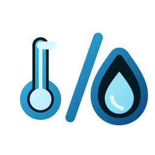
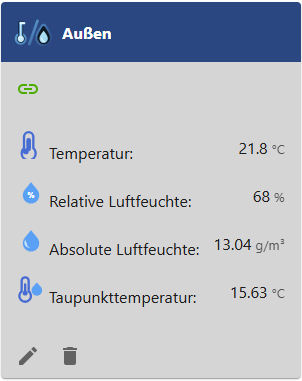

# ioBroker.absolutehumidity

**Tests:** 

## absolutehumidity adapter for ioBroker

build absolute humidity from actual temperature and relative humidity

## Calculation method

The adapter uses empirical Magnus approximation formulas to calculate the
saturation vapor pressure from temperature and relative humidity.

* Absolute humidity is calculated from the saturation vapor pressure using the
  Magnus/Bolton approximation and the ideal gas law. The result is returned in
  g/m³.
* Dew point temperature is calculated using the Magnus formula with Sonntag
  coefficients. The result is returned in °C.

Small deviations from online tables are expected because different tables often
use different Magnus, Tetens, Sonntag, Bolton or Buck coefficient sets.

## Changelog
<!--
	Placeholder for the next version (at the beginning of the line):
	### **WORK IN PROGRESS**
-->
### 0.1.0 (2026-07-07)
* (BenAhrdt) Ready for add to ioBroker latest repo

### 0.0.6 (2026-07-06)
* (BenAhrdt) Sort devices after refresh in case of absolute humidity

### 0.0.5 (2026-07-05)
* (BenAhrdt) Id will change in case of renameing device
* (BenAhrdt) Add second manual calculation for compare

### 0.0.4 (2026-07-05)
* (BenAhrdt) Build Config in adapter own device object

### 0.0.3 (2026-07-05)
* (BenAhrdt) Add new features and icons to deviceManager

[Older changes can be found there](CHANGELOG_OLD.md)

## License
MIT License

Copyright (c) 2026 BenAhrdt <github@ben-schmidt.net>

Permission is hereby granted, free of charge, to any person obtaining a copy
of this software and associated documentation files (the "Software"), to deal
in the Software without restriction, including without limitation the rights
to use, copy, modify, merge, publish, distribute, sublicense, and/or sell
copies of the Software, and to permit persons to whom the Software is
furnished to do so, subject to the following conditions:

The above copyright notice and this permission notice shall be included in all
copies or substantial portions of the Software.

THE SOFTWARE IS PROVIDED "AS IS", WITHOUT WARRANTY OF ANY KIND, EXPRESS OR
IMPLIED, INCLUDING BUT NOT LIMITED TO THE WARRANTIES OF MERCHANTABILITY,
FITNESS FOR A PARTICULAR PURPOSE AND NONINFRINGEMENT. IN NO EVENT SHALL THE
AUTHORS OR COPYRIGHT HOLDERS BE LIABLE FOR ANY CLAIM, DAMAGES OR OTHER
LIABILITY, WHETHER IN AN ACTION OF CONTRACT, TORT OR OTHERWISE, ARISING FROM,
OUT OF OR IN CONNECTION WITH THE SOFTWARE OR THE USE OR OTHER DEALINGS IN THE
SOFTWARE.
